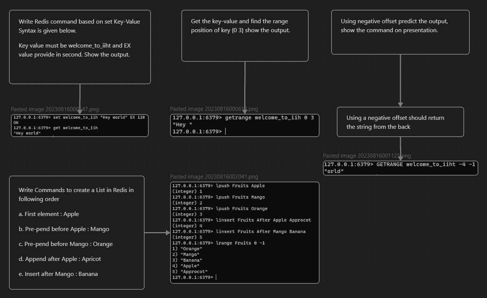

# Some redis stuff

## Projects

1. 
2. 
3. 

## Tasks



## Syntax
1. Basic
* **SET key value**: Sets the value of a key
* **GET key:** Gets the value of a key
* **DEL key:** Deletes a key
* **EXISTS key**: Determines if a key exists.
* **INCR key:** Increments the integer value of a key by one
* **DECR key:** Decrements the integer value of a key by one
* **INCRBY key value:** Increments the integer value of a key by a value
* **INCRBYFLOAT key value:** Increments the integer value of a key by a float value
* **KEYS**: Returns all keys
* **RENAME key value**: Renames value of a key 
* **RENAMENX**: Renames value of a key if not exists
* **TOUCH key**: Updates the latest updated value of a key without getting it
* **UNLINK key**: Deletes a key on a separate thread asynchronously to not slowdown tasks
* **TYPE key**: Gets the type of a key
* **SETEX key seconds value**: Create a key and set an expiry
* **PSETEX key milliseconds value**: Create a key and set an expiry in ms
* **SETRANGE key range_value value**: Replaces the value of a key at a position with a value for the entire length of the value
* **STRLEN key**: Returns length of key
2. Dump and restore - dumping data into a file, then restoring that same data back out again (useful for backups).
```
set hello "world"
> OK 

dump hello
> Checksum: "\x00\x05world\t\x00\xc9#mH\x84/\x11s"
```

Small sized block of data derived from another block of digital data for purpose of detecting errors that may have been introduced during storage or transmission 

```
restore hello ttl_value=0 (never expire) serialized-value [REPLACE (will replace key value if exists)]
```

3. List 
* Lists in Redis are implemented like a Linked list so they have faster insertion/ deletion but slower access
* **LSET key value**: Set a value to an index of a list
* **LPUSH key value**: Prepends a value to a list
* **RPUSH key value**: Appends a value to a list
* **LPOP key:** Removes and returns the first element of a list
* **RPOP key:** Removes and returns the last element of a list
* **LRANGE key start_position stop_position**: Returns the list values on specified index
* **LTRIM key start_position stop_position**: Trims the list values on specified index
* **(L/R)PUSHX key value**: Appends/ Prepends value to list if key exists
* **LINSERT key (BEFORE/AFTER) pivot value**: Insert a value to list before or after a pivot value
* **LLEN key**: Returns length of list
* **LREM key count value**: Remove a number of values from the list. Count of 0 removes all values.

4. Hashes
* Redis hashes are maps between string fields and string values. They are useful to represent objects such as a user with fields like name, surname, etc but can be used for other data too. Hashes can store up to 2^32-1 field value pairs. 
* **HSET hash field value**: Create a hash and add a pair of key value
* **HGET hash field value**: Returns the value of the hash's key
* **HGETALL hash**: Returns all of the string field and string value for the object
* **HMGET hash fields**: Hash multi-get, this retrieves multiple values from a hash at once instead of making multiple calls to HGET 
* **HKEYS hash**: Returns all keys of hash
* **HVALS hash**: Returns all values of hash
* **HEXISTS hash**: Return boolean if key exists
* **HLEN hash**: Return amount of key value pairs in hash
* **HSETNX hash key value**: Sets a key value pair to hash if key does not exist
* **HDEL hash key**: Deletes a field from hash
* **HINCRBY hash key value**: Increments a field value by an amount
* **HINCRBYFLOAT hash key value**: Increment a field value by a float amount
* **HSTRLEN hash key value**: Returns length of key's value 

5. Sets
* Redis sets re unordered collection of strings. You can add, remove and test for existence of members. Supports number of server side commands to compute sets starting from existing sets, so u can do unions, intersections, differences of sets in very short time. The max nubmer of members in a set is 2^32 -1 members per seta

* **SADD key member**: Adds a member to a set
* **SREM key member**: Removes a member from a set
* **SISMEMBER key member**: Determines if a member is in a set
* **SMEMBERS key**: Returns all the members of a set
* **SMOVE source destination member**: Moves a member to a different set
* **SPOP key amount**: Pops an amount of members from the set

* Set operations
    1. Difference of set (A minus B)
    * **SDIFF A B** 
    2. Intersection of set (A n B)
    * **SINTER A B**
    3. Union of set (A U B)
    * **SUNION A B**
* You can also add store at the end like **SDIFFSTORE destination a b** to store the results to a different set

6. Sorted sets
* Are similar to a mix between a set and a hash. Composed of unique, non-repeating string element which are ordered. Every element in the sorted set is associated with a floating point value called score. Every element is mapped to this score (similar to hash). Sorted sets sort by score and by alphabetical order for members with same score. 
* **ZADD key NX|XX GT|LT CH INCR score member [score member ...]**: Adds member to sorted set with a float score. You can specify CH to get the amount of members changed in the set and INCR to increment score to a member
* **ZRANGE key start stop**: Print sorted set members
* **ZCARD key**: Returns length of sorted set
* **ZSCORE key member**: Returns score of member within sorted set
* **ZREM key [members ]**: Removes key from sorted set
* **ZREVRANGE key start stop**: Prints sorted set members in reverse
* **ZRANK key start stop**: Returns the index of the set member
* **ZCOUNT key min max**: Returns count of keys with score in range of min and max
* **ZPOPMAX key amount**: Removes the top amount of members from a sorted set
* **ZRANGEBYLEX key min max**: Returns lexicographical ordering of members. E.g. A -> B 
    * [member,...] - Include character
    * (member,...) - Exclude character
* **ZLEXCOUNT key lex**: Returns count of members in set including or excluding members
* **ZREMRANGEBYSCORE key start end**: Removes members in set which are between the start and end scores

7. Transaction
* A transaction in Redis consists of a block fo commands using "Multi", "Exec", "Discord", "Watch". All the commands in a transaction are serialized and executed sequentially. A request issued by another client cannot be served in the middle of the execution of a Redis transaction. This guarantees the commands are executed a single isolated operation at a point
* Either all of the commands are processed or not at all, so Redis transaction is also atomic so if a client passes an invalid command to the server in the context of a transaction then none of the operations are performed

* **MULTI** to start a transaction. You are then add statements like **SET bank_account 1000** and a few statements later you can execute all of the statements using **EXEC**
* If there are errors before an exec occurs, such as wrong number of arguments, wrong command name etc, Redis will throw an error. if the syntax of the command is fine but the operation is incorrect on the wrong kind of data type, it is considered a developer error and the rest of the transaction will continue
* Using **discard**  after multi discards the transaction so using **exec** does not commit the transaction
* **watch** can be used to do monitoring on the key

1. Case 1: If you watch a key and make a change to a key before a transaction, the transaction does't go through. 
```
watch bank1
incrby bank100 
multi 
incrby bank50   // this will fail since watch has been done before incrby bank100
incrby bank49    // this will succeed as it's now unwatched by another process
exec             // This executes both commands
```
2. Case 2: If client A watches a key and client B makes a change to the key, any subsequent transactions that client A makes will not go through. After exec occurs, the keys will be unwatched. To unwatch a key you can use **unwatch** command to unwatch all watched keys
3. Case 3: If client A has an **unwatch** key inside of a transaction and client B changes a value inside the key, the transaction itself will not execute, hence the **unwatch** command itself will not execute

8. Scripting & connection
Redis allows you to create your own scrips using Lua scripts on the Redis server, enabling you to perform complex operations directly on the server without having to send multiple commands from y our application. This can help reduce latency, decrease network traffic, and simplify application logic. Scripts can use programmatic control structures and use most of the commands with access to the database. Because scripts execute in the server, reading and writing data from the scripts is very efficient. Redis guarantees the script's atomic execution. Script executes where data lives, blocking semantics that ensure script's atomic execution. It also includes simple capabilities which are not in Redis that might be too niche such as HyperLogLog data structure support (used for estimating the number of distinct elements in a multiset). Range queries in sorted sets, clients handling with client command, latency monitoring with latency command, better LRU (least recently used) algorithm to manage cache, massively better list type memory usage. Quicklists are more memory efficient of Redis lists. Lua bit which allows you to perform bitwise operations on numbers. 

For example: 
 `eval "redis.call('set', KEYS[1], ARGV[1])" 1 name Neer`
* Eval command evaluates the script using the Lua interpreter. The script calls set command in Redis to set the value of a key. The keys and args tables are used to pass the arguments to the scripts.

1. Example 1: This example shows how to use the EVAL command to execute a simple Lua script in Redis1:
`EVAL "return 'Hello, scripting!'" 0` 

This script returns the string "Hello, scripting!" when executed. The EVAL command takes two arguments: the first is the Lua script to execute, and the second is the number of keys that the script will access. In this case, we pass 0 as the second argument because our script does not access any keys.

2. Example 2: This example shows how to use the `redis.call` function to execute a Redis command from within a Lua script:
`eval "redis.call('set', KEYS[1], ARGV[1])" 1 name Neer`
 
This script calls the set command in Redis to set the value of a key. The KEYS and ARGV tables are used to pass arguments to the script. In this case, KEYS[1] is set to "key", and ARGV[1] is set to "Neer". When the script is executed, it will call the set command in Redis with these arguments, setting the value of the key "key" to "Neer".

3. Example 3: This example shows how to use control structures in a Lua script to perform conditional updates on multiple keys:
```
EVAL "
local val = redis.call('get', KEYS[1]);
if val == ARGV[1]
then redis.call('set', KEYS[2], ARGV[2])
end" 
2 key1 key2 1 2
```
This script uses an if statement to check if the value of the key specified by KEYS[1] is equal to the value specified by ARGV[1]. If this condition is true, then the script calls the set command in Redis to set the value of the key specified by KEYS[2] to the value specified by ARGV[2].

Lua scripting: https://www.tutorialspoint.com/lua/index.htm

* Storing scripts, with some control flow 

    1. Using set multi hash set to create a mapping between country and capitals
    `hmset country_capitals India "New Delhi" USA "Wash DC" Germany Berlin Japan Tokyo`
    2. Making a country sorted set to do the mapping on
    `zadd country 1 India 2 Germany 3 Japan`
    3. EVAL command to execute a Lua script that retrieves the capitals of the countries in the country sorted set in the order they appear in the sorted set. The script first uses the **ZRANGE** command to get the countries from the country sorted set in ascending order of their scores. Then it uses the **HMGET** command to get the capitals of these countries from the **country_capitals** hash map.

    ```eval "
    local order = redis.call('zrange', KEYS[1], 0, -1);
    return redis.call('hmget', KEYS[2], unpack(order))" 2 country country_capitals`

    3. Saving as a script
    ```
     script load " local order = redis.call('zrange', KEYS[1], 0, -1); return redis.call('hmget', KEYS[2], unpack(order))"
     > cdc499534bb199d133972ef94776e3b3a16a59a8
    ```
    3. Running it 
    
    If a script is running, everything else is waiting so ensure that scripts aren't too long, causing bottlenecks. You can kill a script taking too long with KILL (if it is not currently executing a write command, otherwise u need wait until it is completed)
    
    If the script is already loaded into Redis's cache, you can use `EVALSHA` command to execute the script and gain some performance increase by not having to send the SHA1 digest to the server and not having to calculate the SHA1 digest of the script. You can check if script exists already using `SCRIPT EXISTS`
    
    `evalsha cdc499534bb199d133972ef94776e3b3a16a59a8 2 country country_capitals`

* Connections and security
- You can use `ping` to verify connection
- For single node redis db , you can use `select index` to change databases. All databases are stored on the same file. For redis clusters, the databases would be index 0
- Can use `client` commands to see `client list`, `client name`to identify clients, stop clients with `client kill id`, etc.
- You can create passwords for clients to login using a configuration for security. You can use `config set requirepass pass`. 
- To login you can use `auth pass`. Redis doesn't have built in support for usernames.

9. Publish/ subscribe
* You can create a simple message bus. This allows Redis to act as a broker for multiple clients providing a simple way to post and consume messages and events. Senders (publishers) are not programmed to send their messages to specific receivers (subscribers). The sender doesn't know who they are sending the message to and instead sent it to the channel/ bus who then sends it to the receiver who have subscribed to it. Messages are received only if the client is subscribed to the channel at the time of the message being published.

- To send message, you can use `publish channel_name message`
- You can subscribe using `subscribe channel_name`

* You can create patterned subscriptions

- You can subscribe using `psubscribe pattern`. If any messages are sent to channels that match the channel name pattern, it is sent to the receiver. E.g. `ch?` could represent a channel "ch" followed by a character like 0-9 or a-z or !£*. 
- You can use `pubsub` for administration like finding out how many subscribers a channel has. 
    1. `pubsub numsub`- returns number of subs a channel has. Doesn't count patterned subscription.
    2. `pubsub numpat`- returns number of patterned subs a channel has 